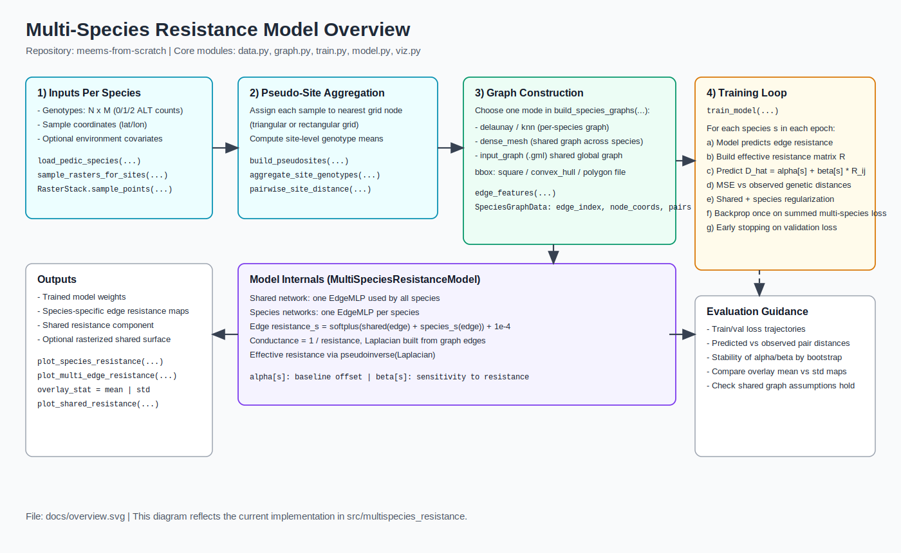
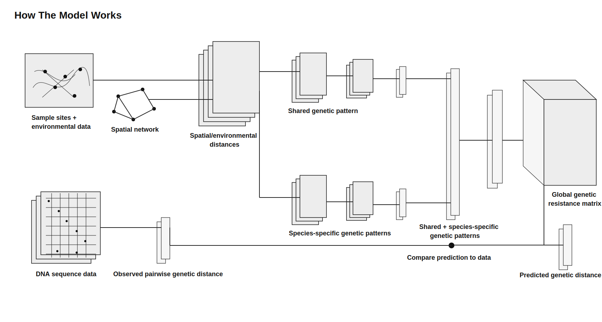

# Multi-Species Resistance Model

Inferring shared and species-specific barriers to gene flow from spatial genetic data

Repo: `meems-from-scratch`

---

# Motivation

- We want to explain observed genetic differences among sampled populations using landscape structure.
- Different species may respond to the same landscape in similar ways, but not identically.
- A shared model can borrow strength across species while still allowing species-specific deviations.

---

# Core Question

- Given sample locations, genotypes, and environmental covariates:
- What pattern of movement difficulty across the landscape best explains the observed genetic distances?

---

# Inputs

- Sample-level genotype matrix for each species
- Geographic coordinates for each sample
- Optional environmental rasters sampled onto graph nodes
- A shared spatial graph:
  - built internally as a mesh, or
  - supplied externally as a `.gml` graph

---

# End-to-End Workflow

---

# Data Representation

- Each species starts as `SpeciesData(name, genotypes, sample_coords)`.
- Samples are assigned to nearby graph nodes.
- Genotypes are aggregated at occupied nodes.
- Pairwise genetic distances are computed between occupied nodes.
- The resulting `SpeciesGraph` stores:
  - graph structure
  - edge covariates
  - observed sample coordinates
  - pairwise training targets

---

# Graph Construction

- Nodes define the spatial support of the model.
- Edges connect nearby nodes and represent possible movement pathways.
- Edge features typically include:
  - geographic edge length
  - environmental differences between edge endpoints
- If no environmental rasters are supplied, the edge feature matrix contains only edge length.

---

# Model Structure

---

# What the Neural Network Predicts

- The neural network does not predict genetic distance directly.
- It predicts a resistance value for each graph edge.
- One network is shared across all species.
- A second network is species-specific.
- The two outputs are added together to produce the final edge resistance for a species.

---

# From Edge Resistance to Genetic Distance

- Edge resistances define how difficult movement is across each local connection.
- These edge values are assembled into a graph Laplacian.
- The Laplacian is used to compute effective resistance between all node pairs.
- Effective resistance summarizes how well two nodes are connected through the whole graph, not just one path.
- For each species, predicted genetic distance is:
  - a species-specific intercept plus
  - a species-specific slope times effective resistance

---

# Training

- Training is supervised.
- Targets are observed pairwise genetic distances between occupied nodes.
- In each epoch:
  - predict edge resistances
  - compute the effective-resistance matrix
  - extract predicted distances for observed node pairs
  - compare to observed genetic distances
  - update model parameters with gradient-based optimization
- The optimizer is Adam.

---

# Regularization and Validation

- The loss combines:
  - mean squared error on observed pairwise distances
  - penalties on large shared and species-specific edge logits
  - optional smoothing across neighboring edges
- The training code can use:
  - a hold-out validation split
  - early stopping
  - restoration of the best validation state
- A separate graph-based CV module can tune hyperparameters such as edge smoothing.

---

# What This Model Is and Is Not

- It is a supervised learning model.
- It is graph-based.
- It uses neural networks to parameterize edge resistance.
- It is not a standard graph neural network:
  - there is no message passing layer
  - node embeddings are not propagated through graph convolutions

---

# Why This Approach Is Useful

- It combines mechanistic graph structure with flexible function approximation.
- It can estimate:
  - shared barriers or corridors across species
  - species-specific departures from that shared pattern
- It naturally accommodates:
  - irregular sampling
  - landscape covariates
  - externally supplied graphs

---

# Current Practical Challenges

- Inference can reflect graph geometry if the mesh is too regular or too fine.
- Unsupported parts of the graph can influence results unless down-weighted.
- Effective-resistance computations become expensive on large graphs.
- Mesh construction and validation strategy strongly affect model behavior.

---

# Take-Home Message

- The model learns a resistance surface on a spatial graph.
- That surface is trained to explain observed genetic distances.
- Shared and species-specific components are learned jointly.
- The graph provides the spatial mechanism.
- The neural network provides flexibility in how environmental and spatial features map to resistance.
